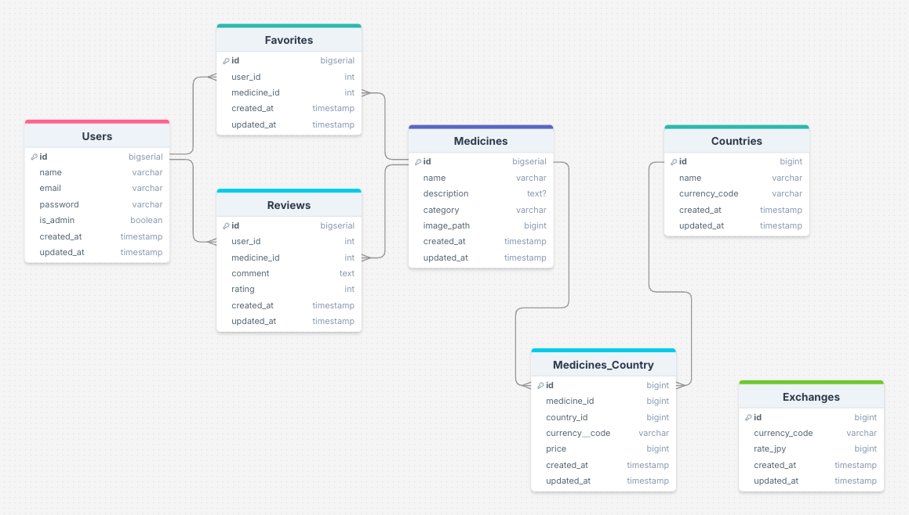

# MediNavi Asia

MediNavi Asia は、東南アジア地域で販売されている薬の情報を検索・比較できる Web アプリケーションです。

旅行者や現地に住む日本人が、現地の薬局で薬を購入する際の手助けとなることを目的としています。

現在は MVP（Minimum Viable Product）段階のため、機能および薬データは最小限ですが、今後は薬情報の充実およびジオロケーション API による位置情報連動検索の導入を予定しています。

※ 本アプリケーションは、スマートフォン・PCでご利用いただけるよう、レスポンシブデザインに対応しています。

---

## ビジュアルガイド

### ユーザーインターフェース

PC画面のwelcomeページと検索画面です。


レスポンシブデザインの画面です。

### データベース構造図

アプリケーションで使用しているデータベースの構造図です。drawSQL 使用。


## 技術スタック

### バックエンド

- **フレームワーク**: Laravel 12
- **データベース**: PostgreSQL

### フロントエンド

- **CSS フレームワーク**: Tailwind CSS
- **ビルドツール**: Vite 4.0.0

### 開発環境

- **コンテナ化**: Laravel Sail (Docker)

## 環境構築

### 必要条件

- Docker
- Docker Compose
- PHP 8.2 以上（または 8.3 以上）
- Composer

### インストール手順

```bash
# リポジトリのクローンと移動
git clone https://github.com/yourusername/medinavi-asia.git
cd medinavi-asia

# 環境設定
cp .env.example .env

# Dockerコンテナの起動
./vendor/bin/sail up -d

# 依存パッケージのインストール
./vendor/bin/sail composer install

# アプリケーション初期化
./vendor/bin/sail artisan key:generate
./vendor/bin/sail artisan migrate --seed
./vendor/bin/sail artisan storage:link

# フロントエンドのセットアップ
./vendor/bin/sail npm install
```

シードデータには以下が含まれています：

- 管理者アカウント
- テストユーザー
- サンプル薬データ（各カテゴリー複数種類）
- 国情報（インドネシア、マレーシア、タイ、ベトナム）

> 注意: 画像が表示されない場合は、シンボリックリンクが正しく生成されていない可能性があります。その場合は`./vendor/bin/sail artisan storage:link`コマンドを再度実行してください。また、アップロードされた画像のパーミッションも確認してください。

### 開発サーバーの起動

アプリケーションを開発モードで実行するには、以下のコマンドを実行してください：

```bash
# Dockerコンテナの起動（すでに起動している場合は不要）
./vendor/bin/sail up -d

# フロントエンド開発サーバーの起動
./vendor/bin/sail npm run dev
```

ブラウザで http://localhost にアクセスすると、アプリケーションが表示されます。

## 主な機能

### ユーザー向け機能

- **薬の検索**: 名前やカテゴリーから薬を検索できます
- **カテゴリー別表示**: 腹痛薬、解熱鎮痛薬、胃腸薬などのカテゴリー別に薬を一覧表示
- **国別価格表示**: インドネシア、マレーシア、タイ、ベトナムなど各国での価格情報を表示
- **お気に入り機能**: 頻繁に使用する薬をお気に入りに登録し、一覧で確認できます

### 管理者向け機能

- **薬情報の登録**: 新しい薬の情報を登録できます
- **複数国の販売情報管理**: 各国ごとの価格や通貨情報を管理できます
- **薬情報の削除**: 不要になった薬の情報を削除できます

### 使用方法

1. 薬の検索

    - ホーム画面の検索バーから薬名を入力して検索
    - または、カテゴリーから薬を選択

2. お気に入り機能

    - 薬の詳細ページでハートアイコンをクリックして登録
    - ナビゲーションメニューから「お気に入り」を選択して一覧表示

3. 管理者機能（管理者アカウントのみ）
    - ナビゲーションメニューから「管理画面」を選択
    - 新規登録ボタンから薬の情報を登録
    - 各国の価格情報を入力して保存
