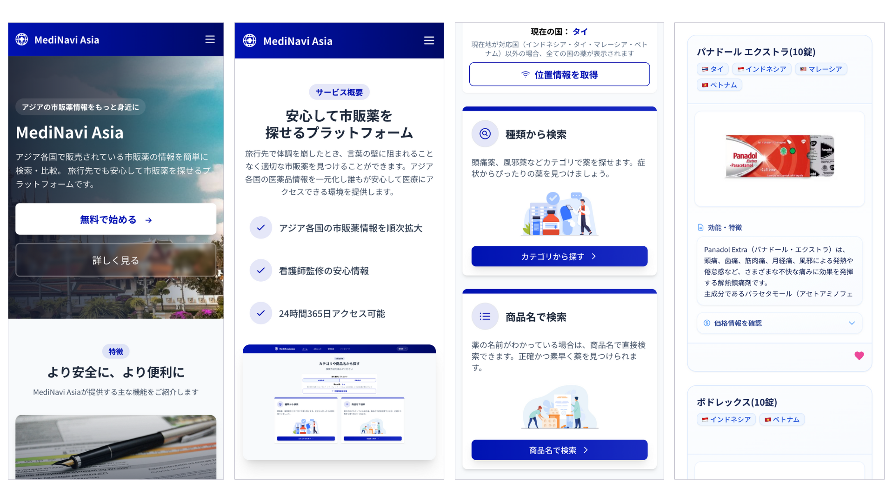

# MediNavi Asia

MediNavi Asia は、東南アジア地域の市販薬情報を検索・比較できる Webアプリケーションです。

インドネシア、タイ、マレーシア、ベトナムの4カ国を対象に、旅行者や現地在住の日本人の皆様が、安心して市販薬を選べるようにサポートしたいと考え開発しました。アイディアは、私自身が東南アジアで体調を崩した際に「こんなサービスがあったらいいな」と思った経験から生まれています。位置情報を活用した検索機能も搭載しており、滞在国の市販薬を簡単に見つけることができます。

※ 本アプリケーションは、スマートフォンおよびPCに対応したレスポンシブデザインを採用しています。

※ Nominatim APIはアクセス数が多いと一定時間、位置情報取得ができなくなる可能性があります。ご了承ください。

---

## スクリーンショット

### トップページ


### 市販薬検索


### 検索結果


### 管理画面


### レスポンシブデザイン


---

## 主な機能

- 薬の検索機能（商品名・症状別カテゴリから探せます）
- 国選択機能（位置情報による自動取得・手動選択・全ての国を表示するALLモード）
- 国別価格表示（現地通貨と日本円で価格を確認できます）
- お気に入り登録機能
- 管理者アカウントでログインすれば薬情報管理（登録・編集・削除）が可能です

```管理者```：admin@example.com / password

---

## URL
 coming soon

## 使用技術

### バックエンド
- PHP
- Laravel 12
- Composer（パッケージ管理）

### フロントエンド
- HTML5/CSS3
- Tailwind CSS
- JavaScript（ES6+）
- Vite（ビルドツール）
- Node.js/npm（パッケージ管理）

### データベース
- PostgreSQL

### 開発環境
- Docker
- Git/GitHub

### デプロイ
- Laravel Cloud

### その他
- Nominatim API（位置情報サービス）
- OpenStreetMap（地図データ）

---

## データベース


- **Users**: ユーザー情報を管理（管理者権限含む）
- **Medicines**: 薬の基本情報を管理（名前、説明、カテゴリ、画像パス）
- **Countries**: 国情報と通貨コードを管理
- **Medicines_Country**: 薬と国の中間テーブル（各国での価格情報を含む）
- **Favorites**: ユーザーのお気に入り薬情報
- **Reviews**: レビュー情報（将来の機能拡張用）
- **Exchanges**: 通貨の為替レート情報