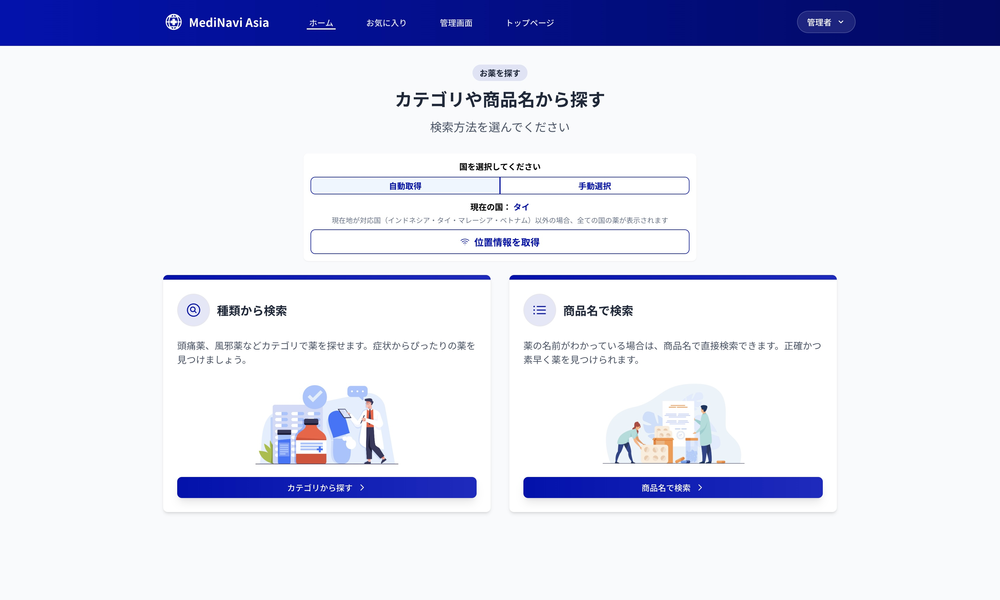

# MediNavi Asia

MediNavi Asia は、東南アジア地域の市販薬情報を検索・比較できる Web アプリケーションです。
旅行者や現地在住の日本人の方が、現地の薬局で適切な市販薬を見つけられるようサポートします。

位置情報から現在地を判定し、滞在国の市販薬のみを表示する「位置情報連動検索」機能も利用可能です（Nominatim API を使用）。

※本アプリケーションは、スマートフォンおよび PC に対応したレスポンシブデザインを採用しています。

---

## 目次

1. [デモ・スクリーンショット](#デモ・スクリーンショット)
2. [主な機能](#主な機能)
3. [技術スタック](#技術スタック)
4. [セットアップ手順](#セットアップ手順)
5. [位置情報・国自動判定の仕組み](#位置情報・国自動判定の仕組み)
6. [API利用制限・注意事項](#api利用制限・注意事項)
7. [管理者アカウント](#管理者アカウント)
8. [データベースとシーダー](#データベースとシーダー)
---

## デモ・スクリーンショット

### トップページ


### 市販薬検索


### 検索結果


### 管理画面


### レスポンシブデザイン


---

## 主な機能

本アプリケーションでは、以下の機能をご利用いただけます：

- 薬の検索機能（商品名・症状カテゴリから探せます）
- 国選択機能（位置情報による自動取得・手動選択・全ての国を表示するALLモード）
- 国別価格表示（各国の通貨で価格を確認できます）
- お気に入り登録機能（気になる薬を保存できます）
- 管理画面での薬情報管理（登録・編集・削除が可能です）

---

## 技術スタック

本アプリケーションは、以下の技術を使用して開発されています：

- **バックエンド**：Laravel 12（PHP 8.2以上）
- **フロントエンド**：Blade テンプレート、Tailwind CSS、Vite
- **データベース**：PostgreSQL
- **開発環境**：Docker（Laravel Sail）

---

## セットアップ手順

### 必要要件

本アプリケーションを開発・実行するには、以下の環境が必要です：

- Docker および Docker Compose
- PHP 8.2以上（ローカル開発時）
- Composer（ローカル開発時）

### インストール方法

以下のコマンドを順番に実行してください：

```bash
# リポジトリのクローンと移動
git clone https://github.com/yourusername/medinavi-asia.git
cd medinavi-asia

# 環境設定
cp .env.example .env

# Docker環境の起動と依存関係のインストール
./vendor/bin/sail up -d
./vendor/bin/sail composer install
./vendor/bin/sail npm install

# アプリケーションの初期化
./vendor/bin/sail artisan key:generate
./vendor/bin/sail artisan migrate --seed
./vendor/bin/sail artisan storage:link

💡 `--seed` オプションを付けてマイグレーションを実行すると、
サンプルの薬データやユーザー情報などの初期データが自動で登録されます。
```

### 開発サーバーの起動

以下のコマンドで開発サーバーを起動できます：

```bash
./vendor/bin/sail npm run dev
```

- アプリケーションのアクセス先：[http://localhost:8000]

※ Viteの開発サーバーが自動的に起動し、フロントエンドの変更は自動的に反映されます

※ 画像が表示されない場合は、以下のコマンドを再実行してください：
```bash
./vendor/bin/sail artisan storage:link
```

---

## 管理者アカウント

🔑 管理画面へのアクセスには、以下のアカウント情報をご利用ください：

- **管理者**：admin@example.com / password
- **テストユーザー**：test@example.com / password

⚠️ これらのアカウントは開発・テスト環境用です。本番環境では必ず変更してください。

---

## 位置情報・国自動判定の仕組み

本アプリケーションの位置情報機能は、以下の流れで動作します：

### 位置情報の取得
- ブラウザの Geolocation API を使用してユーザーの現在地（緯度・経度）を取得します
- 取得した位置情報はユーザーの許可を得た場合のみ利用されます

### 国の自動判定
1. **外部APIによる判定**：Nominatim API（OpenStreetMap）を使用して、緯度・経度から国名・国コードを取得します
2. **範囲判定によるバックアップ**：API が失敗した場合、主要5カ国（インドネシア・タイ・マレーシア・ベトナム・日本）については、あらかじめ設定された緯度・経度の範囲内かどうかで判定します
3. **ALL モード**：上記どちらの方法でも国が特定できない場合は、「ALL モード」に自動的に切り替わり、すべての国の薬が表示されます

※ 「ALL モード」は手動でも選択可能で、国別のフィルタを解除して全ての国の薬を一度に検索できます

---

## API利用制限・注意事項

本アプリケーションでは外部APIを使用しているため、以下の点にご注意ください：

- **Nominatim API の利用制限**：商用利用や大量アクセスは禁止されています
- **利用目的の制限**：本アプリケーションはポートフォリオ・学習用途でのみご利用いただけます
- **商用利用について**：商用目的での利用をご検討の場合は、Google Maps Geocoding API など別のサービスをご検討ください
- **医療情報の扱い**：本サービスの医薬品情報は参考情報です。実際の医療目的には使用しないでください

⚠️ 位置情報の取得はユーザーの許可を得た場合のみ実行され、データの保存は端末のローカルストレージ内のみで行われます。

---

## データベースとシーダー

### データベース構造
本アプリケーションは以下のテーブル構造を持ちます：


- **Users**: ユーザー情報を管理（管理者権限含む）
- **Medicines**: 薬の基本情報を管理（名前、説明、カテゴリ、画像パス）
- **Countries**: 国情報と通貨コードを管理
- **Medicines_Country**: 薬と国の中間テーブル（各国での価格情報を含む）
- **Favorites**: ユーザーのお気に入り薬情報
- **Reviews**: レビュー情報（将来の機能拡張用）
- **Exchanges**: 通貨の為替レート情報

### シーダー
本アプリケーションには以下のシーダーが含まれています：

- **CountrySeeder**: インドネシア、タイ、マレーシア、ベトナムなどの国情報と通貨コードを登録
- **MedicineSeeder**: 各カテゴリ（総合感冒薬、解熱鎮痛薬、整腸剤など）の医薬品情報と国別価格を登録
- **ExchangeSeeder**: 各国通貨の為替レートを登録

### シーダーの個別実行

特定のシーダーのみを実行する場合は、以下のコマンドを使用できます：

```bash
# 医薬品データのみ再シード
./vendor/bin/sail artisan db:seed --class=MedicineSeeder

# すべてのデータを初期化して再シード
./vendor/bin/sail artisan migrate:fresh --seed
```

### データの重複について

`db:seed` コマンドを複数回実行すると、データが重複する可能性があります。
データをリセットするには `migrate:fresh --seed` を使用してください。